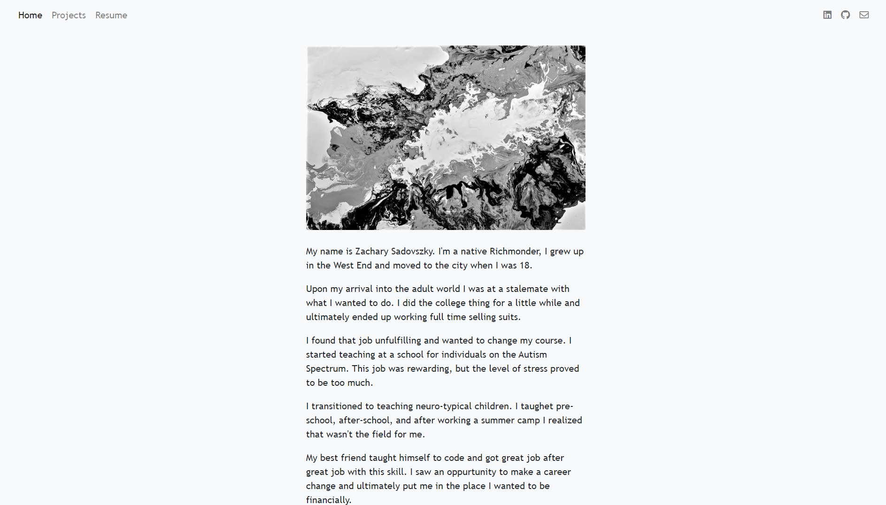
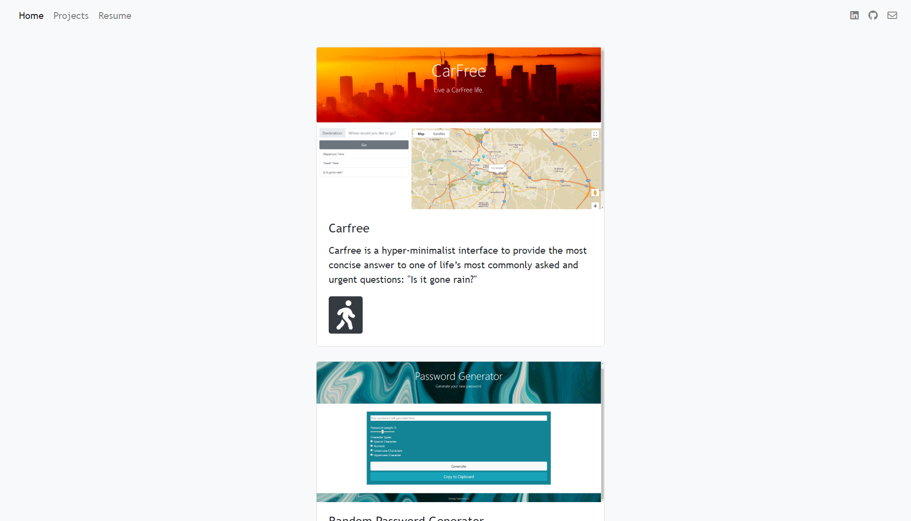
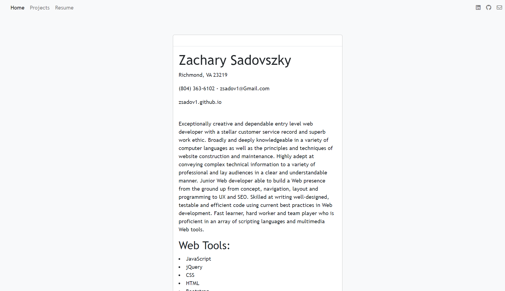

## Professional Portfolio

Description
I made this professional portfolio for the University of Richmond Bootcamp Homework #8. I utilized HTML, CSS, Bootstrap 4, Font Awesome and Javascript (JQuery) to code this page.  I deployed using Github Pages.

As a web developer, I need to a portfolio site deployed that will show my skills to potential employers and clients to hire me. This site also gives me an opportunity to introduce myself, while also providing a way for employers and clients to reach out to me.

License
Copyright (c) 2020 Zachary Sadovszky

Permission is hereby granted, free of charge, to any person obtaining a copy of this software and associated documentation files (the "Software"), to deal in the Software without restriction, including without limitation the rights to use, copy, modify, merge, publish, distribute, sublicense, and/or sell copies of the Software, and to permit persons (if chill enough) to whom the Software is furnished to do so, subject to the following conditions:

The above copyright notice and this permission notice shall be included in all copies or substantial portions of the Software.

THE SOFTWARE IS PROVIDED "AS IS", WITHOUT WARRANTY OF ANY KIND, EXPRESS OR IMPLIED, INCLUDING BUT NOT LIMITED TO THE WARRANTIES OF MERCHANTABILITY, FITNESS FOR A PARTICULAR PURPOSE AND NONINFRINGEMENT. IN NO EVENT SHALL THE AUTHORS OR COPYRIGHT HOLDERS BE LIABLE FOR ANY CLAIM, DAMAGES OR OTHER LIABILITY, WHETHER IN AN ACTION OF CONTRACT, TORT OR OTHERWISE, ARISING FROM, OUT OF OR IN CONNECTION WITH THE SOFTWARE OR THE USE OR OTHER DEALINGS IN THE SOFTWARE.